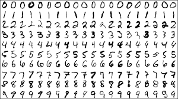

# MNIST classifier

<p align="center">
    
</p>

MNIST classifier with my Neural Network project.

## How to use?
Clone into the project:
```shell
git clone https://github.com/asaldelkhosh/mnist-classifier
```

Install the requirements:
```shell
pip install -r requirements.txt
```

Start the project:
```shell
python main.py
```

## Example
```shell
[INFO] loading MNIST (sample) dataset...
[INFO] samples: 1797, dim: 64
[INFO] training network...
[INFO] NeuralNetwork: 64-32-16-10
[INFO] epoch=1, loss=605.7150149
[INFO] epoch=100, loss=7.9792412
...
```
